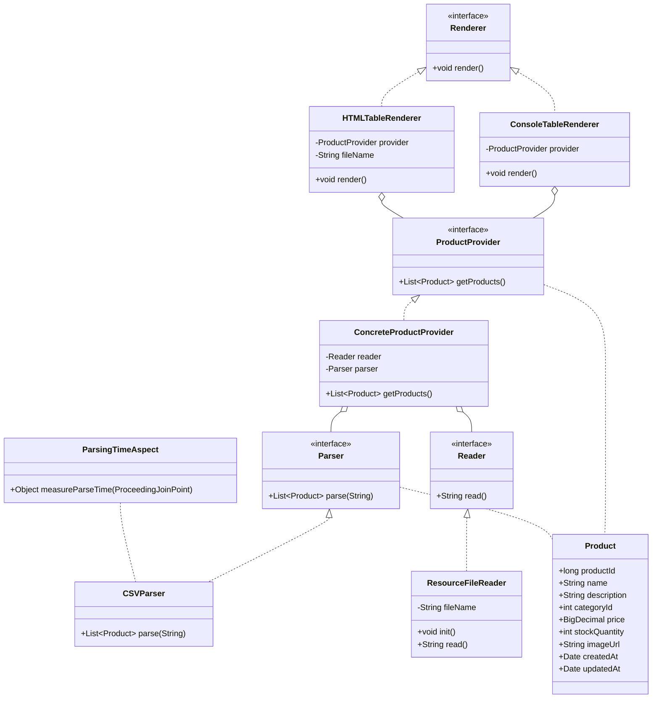

# Отчет о лабораторной работе

## Цель работы

Цель работы - переделать приложение из лабораторной работы 1 на конфигурирование Spring с помощью аннотаций,
добавить вывод таблицы товаров в HTML-файл и измерение времени парсинга CSV-файла с помощью AOP.

## Выполнение работы

Я скопировал результат лабораторной работы 1 в директорию les04/lab.

В файл app/build.gradle.kts я добавил зависимости:

```kotlin
implementation("org.springframework:spring-context:6.2.2")
implementation("org.springframework:spring-aop:6.2.2")
implementation("org.aspectj:aspectjweaver:1.9.22.1")
implementation("jakarta.annotation:jakarta.annotation-api:2.1.1")
```

Я переделал конфигурирование приложения на аннотации:

- классы приложения пометил аннотацией @Component;
- в AppConfig использовал @ComponentScan;
- подключил файл application.properties через @PropertySource;
- включил поддержку AOP через @EnableAspectJAutoProxy.

В файл app/src/main/resources/application.properties я вынес параметры:

products.file=product.csv
products.html=products.html

Имя CSV-файла я внедрил в ResourceFileReader через @Value и SpEL:

@Value("#{environment['products.file']}")
private String fileName;


Я добавил реализацию HTMLTableRenderer, которая формирует HTML-таблицу товаров и сохраняет ее в файл.
При запуске используется именно HTMLTableRenderer, так как он зарегистрирован как бин renderer.

В ResourceFileReader я добавил метод с аннотацией @PostConstruct, который выводит дату и время полной инициализации бина.

Для измерения времени парсинга CSV-файла я добавил аспект ParsingTimeAspect.
Метод CSVParser.parse(...) перехватывается с помощью @Around, после чего в консоль выводится время выполнения.

Приложение запускается командой:

```bash
gradle run
```

После запуска в консоль выводится информация об инициализации ResourceFileReader,
время парсинга CSV-файла и сообщение о создании HTML-файла.

## UML-диаграмма



## Выводы

В ходе работы я перевел приложение с ручной Java-конфигурации на конфигурирование с помощью аннотаций.
Также я добавил вывод товаров в HTML-файл, внедрение параметров из application.properties,
обработку события жизненного цикла бина и измерение времени выполнения метода с помощью Spring AOP.
