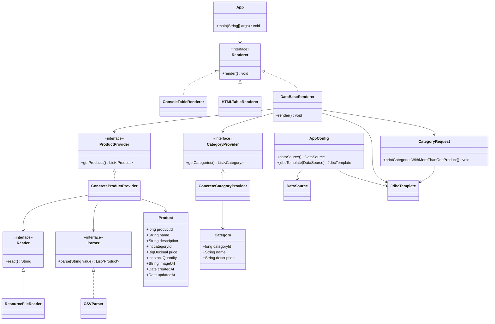

# Лабораторная работа 4

## Тема

Технологии работы с базами данных. JDBC.

## Цель

Подключить к приложению базу данных H2, сохранить в нее данные из CSV-файлов и выполнить SQL-запрос через JDBC.

## Что сделано

- В проект добавлена база данных H2.
- В AppConfig настроены EmbeddedDatabaseBuilder и JdbcTemplate.
- Создан SQL-скрипт schema.sql с таблицами CATEGORIES и PRODUCTS.
- Добавлен класс Category и провайдер ConcreteCategoryProvider.
- Файл category.csv добавлен в src/main/resources.
- Добавлен DataBaseRenderer, который сохраняет категории и продукты в базу данных.
- Добавлен CategoryRequest, который выводит категории, где товаров больше одного.
- Для вывода результата используется logback с уровнем INFO.

## UML-диаграмма

## Вывод

Приложение сохраняет данные из CSV-файлов в таблицы H2 и выводит результат SQL-запроса в консоль.
