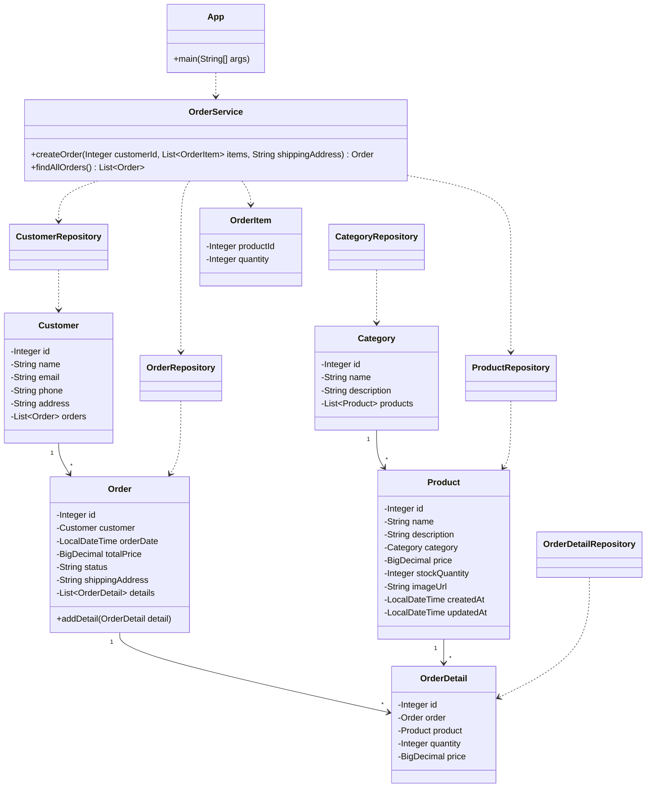

# Лабораторная работа 4

Тема: JPA, Hibernate, Spring Data.

В этой работе было сделано приложение для магазина зоотоваров. Старый подход с JDBC заменен на JPA/Hibernate и Spring Data.

## Что сделано

1. Создан проект в директории les08/lab.
2. Настроена база данных H2.
3. Для подключения к базе используется HikariDataSource.
4. Hibernate сам создает таблицы по JPA-сущностям.
5. Созданы сущности:
   - Category
   - Product
   - Customer
   - Order
   - OrderDetail
6. Для каждой сущности создан Spring Data репозиторий.
7. Создан сервис OrderService, который умеет создавать заказ и получать список заказов.
8. В приложении загружаются данные из CSV-файлов и создается новый заказ.

## Структура пакетов

ru.bsuedu.cad.lab
ru.bsuedu.cad.lab.entity
ru.bsuedu.cad.lab.repository
ru.bsuedu.cad.lab.service
ru.bsuedu.cad.lab.app

## UML-диаграмма классов

## Использованные технологии

- Java 17
- Spring Context
- Spring Data JPA
- Hibernate
- H2 Database
- HikariCP
- Gradle

## Вывод

В ходе лабораторной работы было разработано приложение для магазина зоотоваров с использованием JPA, Hibernate и Spring Data: настроена база данных H2 через HikariCP, созданы сущности, репозитории и сервис заказов, а также реализована загрузка данных из CSV и создание заказа в транзакции.
