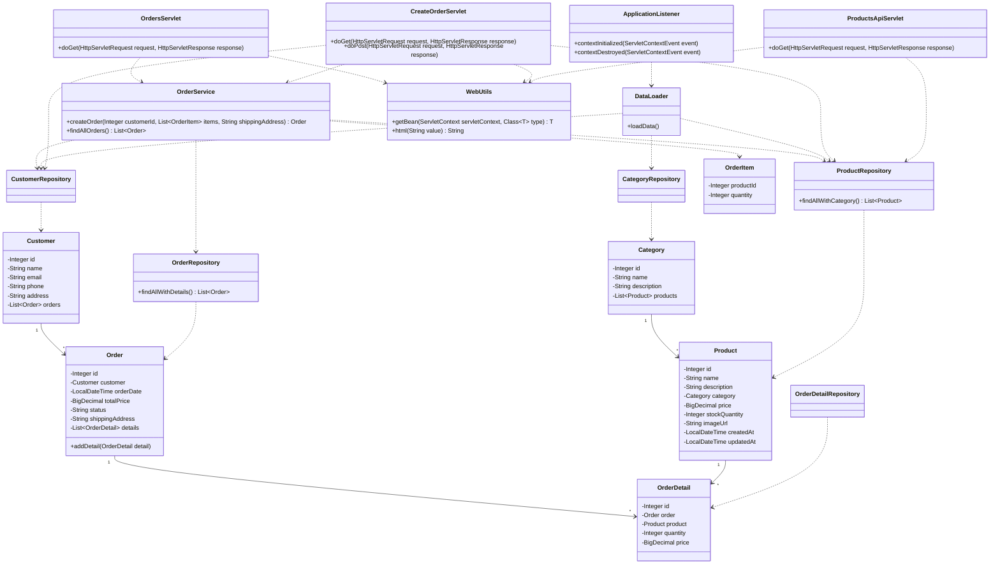

# Лабораторная работа 5

Тема: разработка и развертывание Web-приложений.

В этой лабораторной работе к приложению магазина зоотоваров был добавлен простой Web-интерфейс на Java Servlet.

## Основные URL приложения

После деплоя WAR-файла в Tomcat приложение доступно по адресам:

- `http://localhost:8080/app/orders` - список заказов;
- `http://localhost:8080/app/orders/new` - форма создания заказа;
- `http://localhost:8080/app/api/products` - REST-сервис с продуктами.

## Инструкция по запуску

1. Собрать WAR-файл командой `./gradlew war`.
2. Развернуть `app.war` в Tomcat 11.
3. Открыть `http://localhost:8080/app/orders`.
4. REST-сервис проверить по адресу `http://localhost:8080/app/api/products`.

## UML-диаграмма классов

## Вывод

В ходе лабораторной работы магазин зоотоваров был преобразован в Web-приложение. Добавлены сервлеты для просмотра заказов, создания заказов и получения списка продуктов в формате JSON. Проект собирается в WAR-файл и может быть развернут на Apache Tomcat 11.
