# Лабораторная работа 6

## Разработка Web-приложений с использованием Spring MVC

Цель работы - познакомиться с разработкой Web-приложений на Spring MVC, реализовать REST API и сделать простой пользовательский интерфейс с использованием Thymeleaf.

За основу был взят проект магазина зоотоваров из предыдущей лабораторной работы. Проект был перенесен в директорию les12/lab и настроен как Web-приложение, которое собирается в WAR-файл и может быть развернуто на Apache Tomcat 11.

Для работы приложения был добавлен Spring MVC. Вместо прямой работы с сервлетами используется DispatcherServlet, который подключается через класс AppInitializer. Основная конфигурация приложения находится в классах ConfigBasic и ConfigJpa. В них настраиваются подключение к базе данных, JPA, транзакции, репозитории и Thymeleaf.

Для работы с заказами был реализован REST-контроллер OrderApiController. Он позволяет получить список заказов, получить заказ по идентификатору, создать новый заказ, изменить существующий заказ и удалить заказ. Для передачи данных в REST API используются отдельные модели OrderRequest и OrderResponse, чтобы не возвращать JPA-сущности напрямую.

Также был реализован Web-интерфейс на Thymeleaf. Контроллер OrderController обрабатывает страницы списка заказов, создания нового заказа, изменения заказа и удаления заказа. HTML-шаблоны находятся в директории app/src/main/resources/templates. Интерфейс сделан простым: таблица заказов и форма с выбором покупателя, товара, количества и адреса доставки.

При запуске приложения начальные данные загружаются из CSV-файлов. Для этого используется класс DataLoader. Он загружает категории, покупателей и товары, чтобы после старта приложения можно было сразу создавать заказы.

Приложение собирается командой:

```bash
./gradlew war
```

После сборки WAR-файл находится по пути:

```text
app/build/libs/petshop.war
```

Для деплоя на Tomcat 11 WAR-файл нужно скопировать в директорию webapps:

```bash
cp app/build/libs/petshop.war /path/to/apache-tomcat-11/webapps/petshop.war
```

После запуска Tomcat приложение доступно по адресам:

```text
http://localhost:8080/petshop/orders
http://localhost:8080/petshop/api/orders
```

## UML-диаграмма классов

```mermaid
classDiagram
    class AppInitializer {
        +onStartup(ServletContext servletContext)
    }

    class ConfigBasic {
        +dataSource() DataSource
    }

    class ConfigJpa {
        +entityManagerFactory() LocalContainerEntityManagerFactoryBean
        +transactionManager(EntityManagerFactory entityManagerFactory) PlatformTransactionManager
        +templateResolver() SpringResourceTemplateResolver
        +templateEngine() SpringTemplateEngine
        +viewResolver() ViewResolver
    }

    class HomeController {
        +home() String
    }

    class OrderApiController {
        +findAll() List~OrderResponse~
        +findById(Integer id) OrderResponse
        +create(OrderRequest request) OrderResponse
        +update(Integer id, OrderRequest request) OrderResponse
        +delete(Integer id) void
    }

    class OrderController {
        +list(Model model) String
        +createForm(Model model) String
        +create(OrderForm form) String
        +editForm(Integer id, Model model) String
        +update(Integer id, OrderForm form) String
        +delete(Integer id) String
    }

    class Category {
        -Integer id
        -String name
        -String description
        -List~Product~ products
    }

    class Product {
        -Integer id
        -String name
        -String description
        -Category category
        -BigDecimal price
        -Integer stockQuantity
        -String imageUrl
        -LocalDateTime createdAt
        -LocalDateTime updatedAt
    }

    class Customer {
        -Integer id
        -String name
        -String email
        -String phone
        -String address
        -List~Order~ orders
    }

    class Order {
        -Integer id
        -Customer customer
        -LocalDateTime orderDate
        -BigDecimal totalPrice
        -String status
        -String shippingAddress
        -List~OrderDetail~ details
        +addDetail(OrderDetail detail)
    }

    class OrderDetail {
        -Integer id
        -Order order
        -Product product
        -Integer quantity
        -BigDecimal price
    }

    class OrderForm {
        -Integer customerId
        -Integer productId
        -Integer quantity
        -String shippingAddress
        -String status
    }

    class OrderRequest {
        -Integer customerId
        -String shippingAddress
        -String status
        -List~OrderItem~ items
    }

    class OrderResponse {
        -Integer id
        -Integer customerId
        -String customerName
        -String orderDate
        -BigDecimal totalPrice
        -String status
        -String shippingAddress
        -List~OrderRow~ items
        +fromOrder(Order order) OrderResponse
    }

    class OrderItem {
        -Integer productId
        -Integer quantity
    }

    class OrderService {
        +createOrder(Integer customerId, List~OrderItem~ items, String shippingAddress) Order
        +findAllOrders() List~Order~
        +findOrder(Integer id) Order
        +updateOrder(Integer id, Integer customerId, List~OrderItem~ items, String shippingAddress, String status) Order
        +deleteOrder(Integer id) void
    }

    class DataLoader {
        +loadData() void
    }

    class CategoryRepository
    class ProductRepository
    class CustomerRepository
    class OrderRepository
    class OrderDetailRepository

    Category "1" --> "*" Product
    Customer "1" --> "*" Order
    Order "1" --> "*" OrderDetail
    Product "1" --> "*" OrderDetail

    OrderApiController ..> OrderService
    OrderController ..> OrderService
    OrderController ..> CustomerRepository
    OrderController ..> ProductRepository
    OrderService ..> OrderRepository
    OrderService ..> CustomerRepository
    OrderService ..> ProductRepository
    OrderService ..> OrderItem
    DataLoader ..> CategoryRepository
    DataLoader ..> CustomerRepository
    DataLoader ..> ProductRepository
```



## Вывод

В результате выполнения лабораторной работы приложение магазина зоотоваров было переведено на Spring MVC. Для заказов был реализован REST API и Web-интерфейс на Thymeleaf. Приложение собирается в WAR-файл и может быть развернуто на Apache Tomcat 11.
