# Лабораторная работа 7. Spring Security. Basic Authentication

## Добавление безопасности в приложение

В приложении магазина зоотоваров добавлена защита с помощью Spring Security. Приложение осталось Web-проектом, который собирается в WAR-файл и запускается на Apache Tomcat 11.

Для подключения безопасности в `app/build.gradle.kts` были добавлены зависимости `spring-security-web` и `spring-security-config`. Регистрация Spring Security выполняется через класс `SecurityInitializer`, а основные правила доступа находятся в классе `SecurityConfig`.

В приложении созданы два пользователя. Пользователь `user` имеет роль `USER` и может только просматривать заказы. Пользователь `manager` имеет роль `MANAGER` и может выполнять все операции с заказами: просмотр, создание, изменение и удаление.

Для пользовательского интерфейса сделана авторизация через форму входа. Страница входа находится по адресу `/login`. После успешного входа пользователь попадает на страницу `/orders`, где отображается список заказов. Для пользователя `user` кнопки создания, изменения и удаления скрыты. Для пользователя `manager` эти действия доступны.

Для REST-сервиса настроена Basic Authorization. REST-запросы работают по адресу `/api/orders`. Просмотр заказов доступен пользователям `user` и `manager`, а создание, изменение и удаление заказов доступно только пользователю `manager`.

Приложение собирается командой:

```bash
./gradlew war
```

После запуска Tomcat приложение доступно по адресу:

```text
http://localhost:8080/petshop-security/login
```

## UML-диаграмма классов

```mermaid
classDiagram
    class AppInitializer {
        +getRootConfigClasses()
        +getServletConfigClasses()
        +getServletMappings()
    }

    class SecurityInitializer

    class SecurityConfig {
        +apiFilterChain(HttpSecurity) SecurityFilterChain
        +webFilterChain(HttpSecurity) SecurityFilterChain
        +userDetailsService() UserDetailsService
    }

    class ConfigBasic {
        +dataSource() DataSource
    }

    class ConfigJpa {
        +entityManagerFactory() LocalContainerEntityManagerFactoryBean
        +transactionManager(EntityManagerFactory) PlatformTransactionManager
        +templateResolver() SpringResourceTemplateResolver
        +templateEngine() SpringTemplateEngine
        +viewResolver() ViewResolver
    }

    class HomeController {
        +home() String
    }

    class LoginController {
        +login() String
    }

    class OrderController {
        -OrderService orderService
        -CustomerRepository customerRepository
        -ProductRepository productRepository
        +list(Model, Authentication) String
        +createForm(Model) String
        +create(OrderForm) String
        +editForm(Integer, Model) String
        +update(Integer, OrderForm) String
        +delete(Integer) String
    }

    class OrderApiController {
        -OrderService orderService
        +findAll() List~OrderResponse~
        +findById(Integer) OrderResponse
        +create(OrderRequest) OrderResponse
        +update(Integer, OrderRequest) OrderResponse
        +delete(Integer) void
    }

    class OrderService {
        -OrderRepository orderRepository
        -CustomerRepository customerRepository
        -ProductRepository productRepository
        +createOrder(Integer, List~OrderItem~, String) Order
        +findAllOrders() List~Order~
        +findOrder(Integer) Order
        +updateOrder(Integer, Integer, List~OrderItem~, String, String) Order
        +deleteOrder(Integer) void
    }

    class Category {
        -Integer id
        -String name
        -String description
        -List~Product~ products
    }

    class Product {
        -Integer id
        -String name
        -String description
        -Category category
        -BigDecimal price
        -Integer stockQuantity
        -String imageUrl
        -LocalDateTime createdAt
        -LocalDateTime updatedAt
    }

    class Customer {
        -Integer id
        -String name
        -String email
        -String phone
        -String address
        -List~Order~ orders
    }

    class Order {
        -Integer id
        -Customer customer
        -LocalDateTime orderDate
        -BigDecimal totalPrice
        -String status
        -String shippingAddress
        -List~OrderDetail~ details
        +addDetail(OrderDetail) void
    }

    class OrderDetail {
        -Integer id
        -Order order
        -Product product
        -Integer quantity
        -BigDecimal price
    }

    class OrderForm {
        -Integer customerId
        -Integer productId
        -Integer quantity
        -String shippingAddress
        -String status
    }

    class OrderRequest {
        -Integer customerId
        -String shippingAddress
        -String status
        -List~OrderItem~ items
    }

    class OrderResponse {
        -Integer id
        -Integer customerId
        -String customerName
        -String orderDate
        -BigDecimal totalPrice
        -String status
        -String shippingAddress
        -List~OrderRow~ items
        +fromOrder(Order) OrderResponse
    }

    class OrderItem {
        -Integer productId
        -Integer quantity
    }

    class DataLoader {
        +loadData() void
    }

    class CategoryRepository
    class ProductRepository
    class CustomerRepository
    class OrderRepository
    class OrderDetailRepository

    AppInitializer --> SecurityConfig
    AppInitializer --> ConfigJpa
    SecurityInitializer --> SecurityConfig
    ConfigJpa --> ConfigBasic

    Category "1" --> "*" Product
    Customer "1" --> "*" Order
    Order "1" --> "*" OrderDetail
    Product "1" --> "*" OrderDetail

    LoginController ..> SecurityConfig
    OrderController ..> OrderService
    OrderController ..> CustomerRepository
    OrderController ..> ProductRepository
    OrderApiController ..> OrderService
    OrderService ..> OrderRepository
    OrderService ..> CustomerRepository
    OrderService ..> ProductRepository
    OrderService ..> OrderItem
    DataLoader ..> CategoryRepository
    DataLoader ..> CustomerRepository
    DataLoader ..> ProductRepository
```



## Вывод

В лабораторной работе добавлена безопасность для магазина зоотоваров.
Пользовательская часть защищена формой входа, REST-сервис защищен Basic Authorization.
Роль `USER` может только просматривать заказы, роль `MANAGER` может выполнять все операции с заказами.
