# Лабораторная работа 8. Основы тестирования

## Тестирование магазина зоотоваров

В рамках лабораторной работы проект магазина зоотоваров из лабораторной работы №7 был скопирован в директорию `les16/lab`. Основной целью работы была настройка автоматического тестирования для сервиса создания заказа.

В проект был добавлен плагин JaCoCo для формирования отчета о покрытии кода тестами. Также были подключены зависимости для JUnit 5 и Mockito. Unit-тесты находятся в стандартной директории `app/src/test/java`, а интеграционные тесты вынесены в отдельную директорию `app/src/integrationTest/java`.

Для unit-тестирования был создан класс `OrderServiceTest`. В нем сервис `OrderService` проверяется изолированно от базы данных: репозитории заменяются mock-объектами. В тестах проверяется успешное создание заказа, а также ошибки при отсутствии покупателя и товара.

Для интеграционного тестирования был создан класс `OrderServiceIntegrationTest`. В нем сервис проверяется вместе с настоящими Spring Data JPA репозиториями. Для тестов используется отдельная конфигурация `TestJpaConfig`, которая поднимает базу данных H2 в памяти. Интеграционные тесты проверяют, что заказ действительно сохраняется в базе, а при ошибке товар не найден заказ не создается.

Для полного запуска всех проверок и формирования отчета использовалась команда:

```bash
./gradlew clean test integrationTest jacocoTestReport
```

Всего было выполнено 5 тестов: 3 unit-теста и 2 интеграционных теста. Все тесты завершились без ошибок. Отчет JaCoCo сформирован в директории `app/build/reports/jacoco/test/html/index.html`.

## UML-диаграмма классов

```mermaid
classDiagram
    class AppInitializer {
        +getRootConfigClasses()
        +getServletConfigClasses()
        +getServletMappings()
    }

    class SecurityInitializer

    class SecurityConfig {
        +apiFilterChain(HttpSecurity) SecurityFilterChain
        +webFilterChain(HttpSecurity) SecurityFilterChain
        +userDetailsService() UserDetailsService
    }

    class ConfigBasic {
        +dataSource() DataSource
    }

    class ConfigJpa {
        +entityManagerFactory() LocalContainerEntityManagerFactoryBean
        +transactionManager(EntityManagerFactory) PlatformTransactionManager
        +templateResolver() SpringResourceTemplateResolver
        +templateEngine() SpringTemplateEngine
        +viewResolver() ViewResolver
    }

    class TestJpaConfig {
        +dataSource() DataSource
        +entityManagerFactory(DataSource) LocalContainerEntityManagerFactoryBean
        +transactionManager(EntityManagerFactory) PlatformTransactionManager
    }

    class HomeController {
        +home() String
    }

    class LoginController {
        +login() String
    }

    class OrderController {
        -OrderService orderService
        -CustomerRepository customerRepository
        -ProductRepository productRepository
        +list(Model, Authentication) String
        +createForm(Model) String
        +create(OrderForm) String
        +editForm(Integer, Model) String
        +update(Integer, OrderForm) String
        +delete(Integer) String
    }

    class OrderApiController {
        -OrderService orderService
        +findAll() List~OrderResponse~
        +findById(Integer) OrderResponse
        +create(OrderRequest) OrderResponse
        +update(Integer, OrderRequest) OrderResponse
        +delete(Integer) void
    }

    class OrderService {
        -OrderRepository orderRepository
        -CustomerRepository customerRepository
        -ProductRepository productRepository
        +createOrder(Integer, List~OrderItem~, String) Order
        +findAllOrders() List~Order~
        +findOrder(Integer) Order
        +updateOrder(Integer, Integer, List~OrderItem~, String, String) Order
        +deleteOrder(Integer) void
    }

    class OrderServiceTest {
        +createOrderCreatesNewOrder() void
        +createOrderThrowsExceptionWhenCustomerNotFound() void
        +createOrderThrowsExceptionWhenProductNotFound() void
    }

    class OrderServiceIntegrationTest {
        +createOrderSavesOrderAndDetails() void
        +createOrderDoesNotSaveOrderWhenProductIsMissing() void
    }

    class Category {
        -Integer id
        -String name
        -String description
        -List~Product~ products
    }

    class Product {
        -Integer id
        -String name
        -String description
        -Category category
        -BigDecimal price
        -Integer stockQuantity
        -String imageUrl
        -LocalDateTime createdAt
        -LocalDateTime updatedAt
    }

    class Customer {
        -Integer id
        -String name
        -String email
        -String phone
        -String address
        -List~Order~ orders
    }

    class Order {
        -Integer id
        -Customer customer
        -LocalDateTime orderDate
        -BigDecimal totalPrice
        -String status
        -String shippingAddress
        -List~OrderDetail~ details
        +addDetail(OrderDetail) void
    }

    class OrderDetail {
        -Integer id
        -Order order
        -Product product
        -Integer quantity
        -BigDecimal price
    }

    class OrderForm {
        -Integer customerId
        -Integer productId
        -Integer quantity
        -String shippingAddress
        -String status
    }

    class OrderRequest {
        -Integer customerId
        -String shippingAddress
        -String status
        -List~OrderItem~ items
    }

    class OrderResponse {
        -Integer id
        -Integer customerId
        -String customerName
        -String orderDate
        -BigDecimal totalPrice
        -String status
        -String shippingAddress
        -List~OrderRow~ items
        +fromOrder(Order) OrderResponse
    }

    class OrderItem {
        -Integer productId
        -Integer quantity
    }

    class DataLoader {
        +loadData() void
    }

    class CategoryRepository
    class ProductRepository
    class CustomerRepository
    class OrderRepository
    class OrderDetailRepository

    AppInitializer --> SecurityConfig
    AppInitializer --> ConfigJpa
    SecurityInitializer --> SecurityConfig
    ConfigJpa --> ConfigBasic
    TestJpaConfig ..> CategoryRepository
    TestJpaConfig ..> CustomerRepository
    TestJpaConfig ..> ProductRepository
    TestJpaConfig ..> OrderRepository

    Category "1" --> "*" Product
    Customer "1" --> "*" Order
    Order "1" --> "*" OrderDetail
    Product "1" --> "*" OrderDetail

    OrderController ..> OrderService
    OrderController ..> CustomerRepository
    OrderController ..> ProductRepository
    OrderApiController ..> OrderService
    OrderService ..> OrderRepository
    OrderService ..> CustomerRepository
    OrderService ..> ProductRepository
    OrderService ..> OrderItem
    DataLoader ..> CategoryRepository
    DataLoader ..> CustomerRepository
    DataLoader ..> ProductRepository
    OrderServiceTest ..> OrderService
    OrderServiceIntegrationTest ..> OrderService
    OrderServiceIntegrationTest ..> TestJpaConfig
```



## Вывод

В лабораторной работе проект магазина зоотоваров был подготовлен к автоматизированному тестированию. Для сервиса создания заказа написаны unit-тесты и интеграционные тесты, а также настроен JaCoCo для формирования отчета о покрытии.

Unit-тесты проверяют бизнес-логику сервиса без запуска базы данных. Интеграционные тесты проверяют работу сервиса вместе со слоем репозиториев. Все тесты выполняются успешно, значит сервис создания заказа корректно обрабатывает как успешные, так и ошибочные сценарии.
